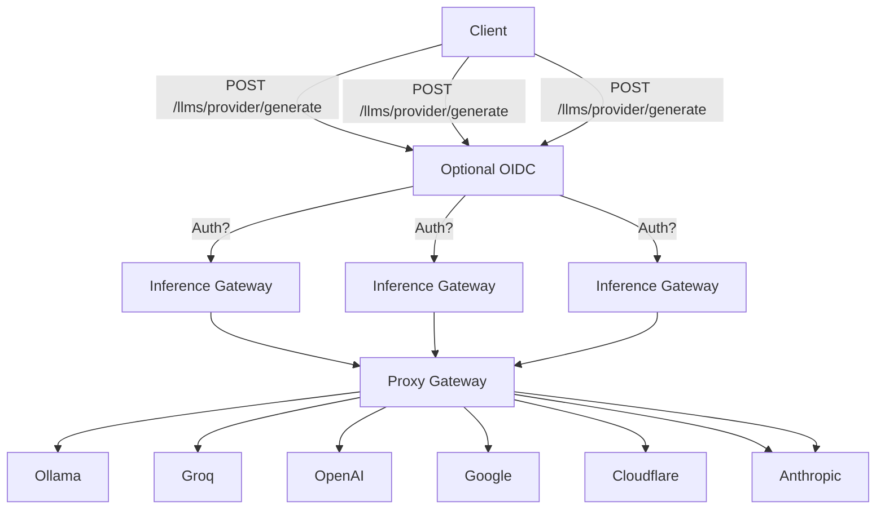

<h1 align="center">Inference Gateway</h1>

<p align="center">
  <!-- CI Status Badge -->
  <a href="https://github.com/inference-gateway/inference-gateway/actions/workflows/ci.yml?query=branch%3Amain">
    
  </a>
  <!-- Version Badge -->
  <a href="https://github.com/inference-gateway/inference-gateway/releases">
    
  </a>
  <!-- License Badge -->
  <a href="https://github.com/inference-gateway/inference-gateway/blob/main/LICENSE">
    
  </a>
</p>

The Inference Gateway is a proxy server designed to facilitate access to various language model APIs. It allows users to interact with different language models through a unified interface, simplifying the configuration and the process of sending requests and receiving responses from multiple LLMs, enabling an easy use of Mixture of Experts.

- [Key Features](#key-features)
- [Overview](#overview)
- [Supported API's](#supported-apis)
- [Configuration](#configuration)
- [Examples](#examples)
- [SDKs](#sdks)
- [License](#license)
- [Contributing](#contributing)
- [Motivation](#motivation)

## Key Features

- 📜 **Open Source**: Available under the MIT License.
- 🚀 **Unified API Access**: Proxy requests to multiple language model APIs, including OpenAI, Ollama, Groq, Cohere etc.
- ⚙️ **Environment Configuration**: Easily configure API keys and URLs through environment variables.
- 🐳 **Docker Support**: Use Docker and Docker Compose for easy setup and deployment.
- ☸️ **Kubernetes Support**: Ready for deployment in Kubernetes environments.
- 📊 **OpenTelemetry Tracing**: Enable tracing for the server to monitor and analyze performance.
- 🛡️ **Production Ready**: Built with production in mind, with configurable timeouts and TLS support.
- 🌿 **Lightweight**: Includes only essential libraries and runtime, resulting in smaller size binary of ~10.8MB.
- 📉 **Minimal Resource Consumption**: Designed to consume minimal resources and have a lower footprint.
- 📚 **Documentation**: Well documented with examples and guides.
- 🧪 **Tested**: Extensively tested with unit tests and integration tests.
- 🛠️ **Maintained**: Actively maintained and developed.
- 📈 **Scalable**: Easily scalable and can be used in a distributed environment - with <a href="https://kubernetes.io/docs/tasks/run-application/horizontal-pod-autoscale/" target="_blank">HPA</a> in Kubernetes.
- 🔒 **Compliance** and Data Privacy: This project does not collect data or analytics, ensuring compliance and data privacy.
- 🏠 **Self-Hosted**: Can be self-hosted for complete control over the deployment environment.

## Overview

You can horizontally scale the Inference Gateway to handle multiple requests from clients. The Inference Gateway will forward the requests to the respective provider and return the response to the client. The following diagram illustrates the flow:



Client is sending:

```bash
curl -X POST http://localhost:8080/llms/openai/generate
  -d '{
    "model": "gpt-3.5-turbo",
    "messages": [
      {
        "role": "system",
        "content": "You are a pirate."
      },
      {
        "role": "user",
        "content": "Hello, world! How are you doing today?"
      }
    ],
  }'
```

Client receives:

```json
{
  "provider": "openai",
  "response": {
    "role": "assistant",
    "model": "gpt-3.5-turbo",
    "content": "Ahoy, matey! 🏴‍☠️ The seas be wild, the sun be bright, and this here pirate be ready to conquer the day! What be yer business, landlubber? 🦜"
  }
}
```

## Supported API's

- [OpenAI](https://platform.openai.com/)
- [Ollama](https://ollama.com/)
- [Groq](https://console.groq.com/)
- [Google](https://aistudio.google.com/)
- [Cloudflare](https://www.cloudflare.com/)
- [Cohere](https://docs.cohere.com/docs/the-cohere-platform)
- [Anthropic](https://docs.anthropic.com/en/api/getting-started)

## Configuration

The Inference Gateway can be configured using environment variables. The following [environment variables](./Configurations.md) are supported.

## Examples

- Using [Docker Compose](examples/docker-compose/)
- Using [Kubernetes](examples/kubernetes/)
- Using standard [REST endpoints](examples/rest-endpoints/)

## SDKs

More SDKs could be generated using the OpenAPI specification. The following SDKs are currently available:

- [Typescript](https://github.com/inference-gateway/typescript-sdk)
- [Rust](https://github.com/inference-gateway/rust-sdk)
- [Go](https://github.com/inference-gateway/go-sdk)
- [Python](https://github.com/inference-gateway/python-sdk)

## License

This project is licensed under the MIT License.

## Contributing

Found a bug, missing provider, or have a feature in mind?  
You're more than welcome to submit pull requests or open issues for any fixes, improvements, or new ideas!

Please read the [CONTRIBUTING.md](./CONTRIBUTING.md) for more details.

## Motivation

My motivation is to build AI Agents without being tied to a single vendor. By avoiding vendor lock-in and supporting self-hosted LLMs from a single interface, organizations gain both portability and data privacy. You can choose to consume LLMs from a cloud provider or run them entirely offline with Ollama.
