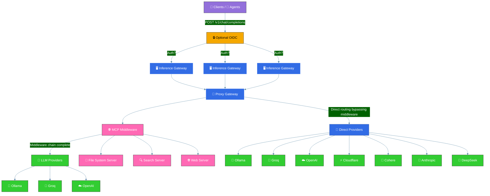

<h1 align="center">Inference Gateway</h1>

<p align="center">
  <!-- CI Status Badge -->
  <a href="https://github.com/inference-gateway/inference-gateway/actions/workflows/ci.yml?query=branch%3Amain">
    
  </a>
  <!-- Version Badge -->
  <a href="https://github.com/inference-gateway/inference-gateway/releases">
    
  </a>
  <!-- License Badge -->
  <a href="https://github.com/inference-gateway/inference-gateway/blob/main/LICENSE">
    
  </a>
  <!-- Go Version Badge -->
  <a href="https://github.com/inference-gateway/inference-gateway/blob/main/go.mod">
    
  </a>
</p>

The Inference Gateway is a proxy server designed to facilitate access to various
language model APIs. It allows users to interact with different language models
through a unified interface, simplifying the configuration and the process of
sending requests and receiving responses from multiple LLMs, enabling an easy
use of Mixture of Experts.

- [Key Features](#key-features)
- [Overview](#overview)
- [Installation](#installation)
- [Middleware Control and Bypass Mechanisms](#middleware-control-and-bypass-mechanisms)
- [Model Context Protocol (MCP) Integration](#model-context-protocol-mcp-integration)
- [Metrics and Observability](#metrics-and-observability)
- [Supported API's](#supported-apis)
- [Configuration](#configuration)
- [Examples](#examples)
- [SDKs](#sdks)
- [CLI Tool](#cli-tool)
- [Contributing](#contributing)
- [License](#license)

## Key Features

- 📜 **Open Source**: Available under the Apache 2.0 License.
- 🚀 **Unified API Access**: Proxy requests to multiple language model APIs,
  including OpenAI, Ollama, Ollama Cloud, Groq, Cohere etc.
- ⚙️ **Environment Configuration**: Easily configure API keys and URLs through environment variables.
- 🔧 **Tool-use Support**: Enable function calling capabilities across supported
  providers with a unified API.
- 🌐 **MCP Support**: Full Model Context Protocol integration - automatically
  discover and expose tools from MCP servers to LLMs without client-side tool
  management.
- 🌊 **Streaming Responses**: Stream tokens in real-time as they're generated from language models.
- 🖼️ **Vision/Multimodal Support**: Process images alongside text with vision-capable models.
- 🐳 **Docker Support**: Use Docker and Docker Compose for easy setup and deployment.
- ☸️ **Kubernetes Support**: Deploy with the
  [Inference Gateway Operator](https://github.com/inference-gateway/operator).
- 📊 **OpenTelemetry**: Monitor and analyze performance.
- 🛡️ **Enterprise Ready**: Built with production in mind, with configurable timeouts and TLS support.
- 🌿 **Lightweight**: Includes only essential libraries and runtime, resulting
  in smaller size binary of ~10.8MB.
- 📉 **Minimal Resource Consumption**: Designed to consume minimal resources and have a lower footprint.
- 📚 **Documentation**: Well documented with examples and guides.
- 🧪 **Tested**: Extensively tested with unit tests and integration tests.
- 🛠️ **Maintained**: Actively maintained and developed.
- 📈 **Scalable**: Easily scalable and can be used in a distributed environment
  with <a href="https://kubernetes.io/docs/tasks/run-application/horizontal-pod-autoscale/" target="_blank">HPA</a>
  in Kubernetes.
- 🔒 **Compliance** and Data Privacy: This project does not collect data or
  analytics, ensuring compliance and data privacy.
- 🏠 **Self-Hosted**: Can be self-hosted for complete control over the deployment environment.
- ⌨️ **CLI Tool**: Improved command-line interface for managing and
  interacting with the Inference Gateway

## Overview

You can horizontally scale the Inference Gateway to handle multiple requests
from clients. The Inference Gateway will forward the requests to the respective
provider and return the response to the client.

**Note**: MCP middleware components can be easily toggled on/off via
environment variables (`MCP_ENABLE`) or bypassed per-request using headers
(`X-MCP-Bypass`), giving you full control over which capabilities are active.

**Note**: Vision/multimodal support is disabled by default for security and
performance. To enable image processing with vision-capable models (GPT-4o,
Claude 4.5, Gemini 2.5, etc.), set `ENABLE_VISION=true` in your environment
configuration.

The following diagram illustrates the flow:


```mermaid
%%{init: {'theme': 'base', 'themeVariables': { 'primaryColor': '#326CE5', 'primaryTextColor': '#fff', 'lineColor': '#5D8AA8', 'secondaryColor': '#006100' }, 'fontFamily': 'Arial', 'flowchart': {'nodeSpacing': 50, 'rankSpacing': 70, 'padding': 15}}}%%


graph TD
    %% Client nodes
    A["👥 Clients / 🤖 Agents"] --> |POST /v1/chat/completions| Auth

    %% Auth node
    Auth["🔒 Optional OIDC"] --> |Auth?| IG1
    Auth --> |Auth?| IG2
    Auth --> |Auth?| IG3

    %% Gateway nodes
    IG1["🖥️ Inference Gateway"] --> P
    IG2["🖥️ Inference Gateway"] --> P
    IG3["🖥️ Inference Gateway"] --> P

    %% Middleware Processing and Direct Routing
    P["🔌 Proxy Gateway"] --> MCP["🌐 MCP Middleware"]
    P --> |"Direct routing bypassing middleware"| Direct["🔌 Direct Providers"]
    MCP --> |"Middleware chain complete"| Providers["🤖 LLM Providers"]

    %% MCP Tool Servers
    MCP --> MCP1["📁 File System Server"]
    MCP --> MCP2["🔍 Search Server"]
    MCP --> MCP3["🌐 Web Server"]

    %% LLM Providers (Middleware Enhanced)
    Providers --> C1["🦙 Ollama"]
    Providers --> D1["🚀 Groq"]
    Providers --> E1["☁️ OpenAI"]

    %% Direct Providers (Bypass Middleware)
    Direct --> C["🦙 Ollama"]
    Direct --> D["🚀 Groq"]
    Direct --> E["☁️ OpenAI"]
    Direct --> G["⚡ Cloudflare"]
    Direct --> H1["💬 Cohere"]
    Direct --> H2["🧠 Anthropic"]
    Direct --> H3["🐋 DeepSeek"]

    %% Define styles
    classDef client fill:#9370DB,stroke:#333,stroke-width:1px,color:white;
    classDef auth fill:#F5A800,stroke:#333,stroke-width:1px,color:black;
    classDef gateway fill:#326CE5,stroke:#fff,stroke-width:1px,color:white;
    classDef provider fill:#32CD32,stroke:#333,stroke-width:1px,color:white;
    classDef mcp fill:#FF69B4,stroke:#333,stroke-width:1px,color:white;

    %% Apply styles
    class A client;
    class Auth auth;
    class IG1,IG2,IG3,P gateway;
    class C,D,E,G,H1,H2,H3,C1,D1,E1,Providers provider;
    class MCP,MCP1,MCP2,MCP3 mcp;
    class Direct direct;
```

Client is sending:

```bash
curl -X POST http://localhost:8080/v1/chat/completions
  -d '{
    "model": "openai/gpt-3.5-turbo",
    "messages": [
      {
        "role": "system",
        "content": "You are a pirate."
      },
      {
        "role": "user",
        "content": "Hello, world! How are you doing today?"
      }
    ],
  }'
```

\*\* Internally the request is proxied to OpenAI, the Inference Gateway inferring the provider by the model name.

You can also send the request explicitly using `?provider=openai` or any other supported provider in the URL.

Finally client receives:

```json
{
  "choices": [
    {
      "finish_reason": "stop",
      "index": 0,
      "message": {
        "content": "Ahoy, matey! 🏴‍☠️ The seas be wild, the sun be bright, and this here pirate be ready to conquer the day! What be yer business, landlubber? 🦜",
        "role": "assistant"
      }
    }
  ],
  "created": 1741821109,
  "id": "chatcmpl-dc24995a-7a6e-4d95-9ab3-279ed82080bb",
  "model": "N/A",
  "object": "chat.completion",
  "usage": {
    "completion_tokens": 0,
    "prompt_tokens": 0,
    "total_tokens": 0
  }
}
```

For streaming the tokens simply add to the request body `stream: true`.

## Installation

> **Recommended**: For production deployments, running the Inference Gateway as
> a container is recommended. This provides better isolation, easier updates,
> and simplified configuration management. See [Docker](examples/docker-compose/)
> or [Kubernetes](examples/kubernetes/) deployment examples.
>
> **Kubernetes**: Deploy with the
> [Inference Gateway Operator](https://github.com/inference-gateway/operator),
> which reconciles a `Gateway` custom resource. (The legacy in-repo Helm chart
> has been removed; use the operator instead.)

The Inference Gateway can also be installed as a standalone binary using the
provided install script or by downloading pre-built binaries from GitHub
releases.

### Using Install Script

The easiest way to install the Inference Gateway is using the automated install script:

**Install latest version:**

```bash
curl -fsSL https://raw.githubusercontent.com/inference-gateway/inference-gateway/main/install.sh | bash
```

**Install specific version:**

```bash
curl -fsSL https://raw.githubusercontent.com/inference-gateway/inference-gateway/main/install.sh | VERSION=v0.22.3 bash
```

**Install to custom directory:**

```bash
# Install to custom location
curl -fsSL https://raw.githubusercontent.com/inference-gateway/inference-gateway/main/install.sh | INSTALL_DIR=~/.local/bin bash

# Install to current directory
curl -fsSL https://raw.githubusercontent.com/inference-gateway/inference-gateway/main/install.sh | INSTALL_DIR=. bash
```

**What the script does:**

- Automatically detects your operating system (Linux/macOS) and architecture (x86_64/arm64/armv7)
- Downloads the appropriate binary from GitHub releases
- Extracts and installs to `/usr/local/bin` (or custom directory)
- Verifies the installation

**Supported platforms:**

- Linux: x86_64, arm64, armv7
- macOS (Darwin): x86_64 (Intel), arm64 (Apple Silicon)

### Manual Download

Download pre-built binaries directly from the [releases page](https://github.com/inference-gateway/inference-gateway/releases):

1. Download the appropriate archive for your platform
2. Extract the binary:

   ```bash
   tar -xzf inference-gateway_<OS>_<ARCH>.tar.gz
   ```

3. Move to a directory in your PATH:

   ```bash
   sudo mv inference-gateway /usr/local/bin/
   chmod +x /usr/local/bin/inference-gateway
   ```

### Verify Installation

```bash
inference-gateway --version
```

### Running the Gateway

Once installed, start the gateway with your configuration:

```bash
# Set required environment variables
export OPENAI_API_KEY="your-api-key"

# Start the gateway
inference-gateway
```

For detailed configuration options, see the [Configuration](#configuration) section below.

## Middleware Control and Bypass Mechanisms

The Inference Gateway uses middleware to process requests and add capabilities
like MCP (Model Context Protocol). Clients can control which middlewares are
active using bypass headers:

### Bypass Headers

- **`X-MCP-Bypass`**: Skip MCP middleware processing

### Client Control Examples

```bash
# Skip MCP middleware for direct provider access
curl -X POST http://localhost:8080/v1/chat/completions \
  -H "X-MCP-Bypass: true" \
  -d '{
    "model": "groq/llama-3-8b",
    "messages": [{"role": "user", "content": "Simple chat without tools"}]
  }'
```

### When to Use Bypass Headers

**For Performance:**

- Skip middleware processing when you don't need tool capabilities
- Reduce latency for simple chat interactions

**For Selective Features:**

- Use only standard tool calls (skip MCP): Add `X-MCP-Bypass: true`
- Direct provider access

**For Development:**

- Test middleware behavior in isolation
- Debug tool integration issues
- Ensure backward compatibility with existing applications

### How It Works Internally

The middlewares use these same headers to prevent infinite loops during their operation:

**MCP Processing:**

- When tools are detected in a response, the MCP agent makes up to 10 follow-up requests
- Each follow-up request includes `X-MCP-Bypass: true` to skip middleware re-processing
- This allows the agent to iterate without creating circular calls

> **Note**: These bypass headers only affect middleware processing. The core
> chat completions functionality remains available regardless of header values.

## Model Context Protocol (MCP) Integration

Enable MCP to automatically provide tools to LLMs without requiring clients to
manage them:

```bash
# Enable MCP and connect to tool servers
export MCP_ENABLE=true
export MCP_SERVERS="http://filesystem-server:3001/mcp,http://search-server:3002/mcp"

# LLMs will automatically discover and use available tools
curl -X POST http://localhost:8080/v1/chat/completions \
  -d '{
    "model": "openai/gpt-4",
    "messages": [{"role": "user", "content": "List files in the current directory"}]
  }'
```

The gateway automatically injects available tools into requests and handles tool
execution, making external capabilities seamlessly available to any LLM.

> **Learn more**:
> [Model Context Protocol Documentation](https://modelcontextprotocol.io/) |
> [MCP Integration Example](examples/docker-compose/mcp/)

## Metrics and Observability

The Inference Gateway provides comprehensive OpenTelemetry metrics for
monitoring performance, usage, and function/tool call activity. Metrics are
automatically exported to Prometheus format and available on port 9464 by
default.

### Enabling Metrics

```bash
# Enable telemetry and set metrics port (default: 9464)
export TELEMETRY_ENABLE=true
export TELEMETRY_METRICS_PORT=9464

# Access metrics endpoint
curl http://localhost:9464/metrics
```

### Available Metrics

Metrics follow the [OpenTelemetry GenAI semantic conventions](https://opentelemetry.io/docs/specs/semconv/gen-ai/).
Every series carries a `source` label: `gateway` for gateway-observed traffic, or a client-supplied value
(e.g. `claude-code-subscription`) for pushed metrics.

| Metric                                                | Type      | Description                                                             |
| ----------------------------------------------------- | --------- | ----------------------------------------------------------------------- |
| `gen_ai_client_token_usage`                           | Histogram | Token usage; `gen_ai_token_type` is `input` or `output`                 |
| `gen_ai_server_request_duration_seconds`              | Histogram | End-to-end request duration in seconds; `error_type` set only on errors |
| `gen_ai_execute_tool_duration_seconds`                | Histogram | Tool execution duration in seconds (fed via the push endpoint)          |
| `gen_ai_client_operation_duration_seconds`            | Histogram | Client-side operation duration (push-only)                              |
| `gen_ai_client_operation_time_to_first_chunk_seconds` | Histogram | Time to first chunk (push-only)                                         |
| `gen_ai_server_time_to_first_token_seconds`           | Histogram | Time to first token (push-only)                                         |
| `inference_gateway_tool_calls_total`                  | Counter   | Total function/tool calls                                               |

**Common labels**: `gen_ai_provider_name`, `gen_ai_request_model`, `gen_ai_operation_name`, `source`;
tool metrics add `gen_ai_tool_type` and `gen_ai_tool_name`; token usage adds `gen_ai_token_type`;
`error_type` (HTTP status string) is present only on errors.

```promql
# Input tokens used by OpenAI models in the last hour
sum(increase(gen_ai_client_token_usage_sum{gen_ai_provider_name="openai", gen_ai_token_type="input"}[1h])) by (gen_ai_request_model)

# 95th percentile request latency by provider (seconds)
histogram_quantile(0.95, sum(rate(gen_ai_server_request_duration_seconds_bucket{gen_ai_provider_name=~"openai|anthropic"}[5m])) by (gen_ai_provider_name, le))

# Error rate percentage by provider
100 * sum(rate(gen_ai_server_request_duration_seconds_count{error_type!=""}[5m])) by (gen_ai_provider_name) / sum(rate(gen_ai_server_request_duration_seconds_count[5m])) by (gen_ai_provider_name)

# Most frequently used tools
topk(10, sum(increase(inference_gateway_tool_calls_total[1h])) by (gen_ai_tool_name))
```

### Pushing Metrics (OTLP)

Clients such as the infer CLI can push their own metrics (e.g. token usage from subscription-based sessions)
to the gateway. Enable the opt-in endpoint with `TELEMETRY_METRICS_PUSH_ENABLE=true` (alongside
`TELEMETRY_ENABLE=true`) and POST OTLP JSON to `POST /v1/metrics`; pushed series are exposed on the same
Prometheus endpoint with the client-supplied `source` label.
See [examples/docker-compose/monitoring](examples/docker-compose/monitoring/README.md) for a full example.

### Monitoring Setup

#### Docker Compose Example

Complete monitoring stack with Grafana dashboards:

```bash
cd examples/docker-compose/monitoring/
cp .env.example .env  # Configure your API keys
docker compose up -d

# Access Grafana at http://localhost:3000 (admin/admin)
```

#### Kubernetes Example

Enterprise-ready monitoring with Prometheus Operator:

```bash
cd examples/kubernetes/monitoring/
task deploy-infrastructure
task deploy-inference-gateway

# Access via port-forward or ingress
kubectl port-forward svc/grafana-service 3000:3000
```

### Grafana Dashboard

The included Grafana dashboard provides:

- **Real-time Metrics**: 5-second refresh rate for immediate feedback
- **Tool Call Analytics**: Success rates, duration analysis, and failure
  tracking
- **Provider Comparison**: Performance metrics across all supported providers
- **Usage Insights**: Token consumption patterns and cost analysis
- **Error Monitoring**: Failed requests and tool call error classification

> **Learn more**:
> [Docker Compose Monitoring](examples/docker-compose/monitoring/) |
> [Kubernetes Monitoring](examples/kubernetes/monitoring/) |
> [OpenTelemetry Documentation](https://opentelemetry.io/)

## Supported API's

- [OpenAI](https://platform.openai.com/)
- [Ollama](https://ollama.com/)
- [Ollama Cloud](https://ollama.com/cloud) (Preview)
- [Groq](https://console.groq.com/)
- [Cloudflare](https://www.cloudflare.com/)
- [Cohere](https://docs.cohere.com/docs/the-cohere-platform)
- [Anthropic](https://docs.anthropic.com/en/api/getting-started)
- [DeepSeek](https://api-docs.deepseek.com/)
- [Google](https://aistudio.google.com/)
- [Mistral](https://mistral.ai/)
- [Moonshot](https://platform.moonshot.ai/)

## Configuration

The Inference Gateway can be configured using environment variables. The
following [environment variables](./Configurations.md) are supported.

### Vision/Multimodal Support

To enable vision capabilities for processing images alongside text:

```bash
ENABLE_VISION=true
```

**Supported Providers with Vision:**

- OpenAI (GPT-4o, GPT-5, GPT-4.1, GPT-4 Turbo)
- Anthropic (Claude 3, Claude 4, Claude 4.5 Sonnet, Claude 4.5 Haiku)
- Google (Gemini 2.5)
- Cohere (Command A Vision, Aya Vision)
- Ollama (LLaVA, Llama 4, Llama 3.2 Vision)
- Groq (vision models)
- Mistral (Pixtral)

**Note**: Vision support is disabled by default for performance and security
reasons. When disabled, requests with image content will be rejected even if the
model supports vision.

## Examples

- Using [Docker Compose](examples/docker-compose/)
  - [Basic setup](examples/docker-compose/basic/) - Simple configuration with a
    single provider
  - [MCP Integration](examples/docker-compose/mcp/) - Model Context Protocol with
    multiple tool servers
  - [Hybrid deployment](examples/docker-compose/hybrid/) - Multiple providers
    (cloud + local)
  - [Authentication](examples/docker-compose/authentication/) - OIDC
    authentication setup
  - [Tools](examples/docker-compose/tools/) - Tool integration examples
- Using [Kubernetes](examples/kubernetes/)
  - [Basic setup](examples/kubernetes/basic/) - Simple Kubernetes deployment
  - [MCP Integration](examples/kubernetes/mcp/) - Model Context Protocol in
    Kubernetes
  - [Agent deployment](examples/kubernetes/agent/) - Standalone agent deployment
  - [Hybrid deployment](examples/kubernetes/hybrid/) - Multiple providers in
    Kubernetes
  - [Authentication](examples/kubernetes/authentication/) - OIDC authentication
    in Kubernetes
  - [Monitoring](examples/kubernetes/monitoring/) - Observability and monitoring
    setup
  - [TLS setup](examples/kubernetes/tls/) - TLS/SSL configuration
- Using standard [REST endpoints](examples/rest-endpoints/)

## SDKs

More SDKs could be generated using the OpenAPI specification. The following
SDKs are currently available:

- [Typescript](https://github.com/inference-gateway/typescript-sdk)
- [Rust](https://github.com/inference-gateway/rust-sdk)
- [Go](https://github.com/inference-gateway/go-sdk)
- [Python](https://github.com/inference-gateway/python-sdk)

## CLI Tool

The Inference Gateway CLI provides a powerful command-line interface for
managing and interacting with the Inference Gateway. It offers tools for
configuration, monitoring, and management of inference services.

### CLI Key Features

- **Status Monitoring**: Check gateway health and resource usage
- **Interactive Chat**: Chat with models using an interactive interface
- **Configuration Management**: Manage gateway settings via YAML config
- **Project Initialization**: Set up local project configurations
- **Tool Execution**: LLMs can execute whitelisted commands and tools

### CLI Installation

#### Using Go Install

```bash
go install github.com/inference-gateway/cli@latest
```

#### Using CLI Install Script

```bash
curl -fsSL https://raw.githubusercontent.com/inference-gateway/cli/main/install.sh | bash
```

#### Manual CLI Download

Download the latest release from the
[releases page](https://github.com/inference-gateway/cli/releases).

### Quick Start

1. **Initialize project configuration:**

   ```bash
   infer init
   ```

2. **Check gateway status:**

   ```bash
   infer status
   ```

3. **Start an interactive chat:**

   ```bash
   infer chat
   ```

For more details, see the [CLI documentation](https://github.com/inference-gateway/cli).

## License

This project is licensed under the Apache 2.0 License.

## Contributing

Found a bug, missing provider, or have a feature in mind?  
You're more than welcome to submit pull requests or open issues for any fixes, improvements, or new ideas!

Please read the [CONTRIBUTING.md](./CONTRIBUTING.md) for more details.

## Motivation

My motivation is to build AI Agents without being tied to a single vendor. By
avoiding vendor lock-in and supporting self-hosted LLMs from a single interface,
organizations gain both portability and data privacy. You can choose to consume
LLMs from a cloud provider or run them entirely offline with Ollama.
