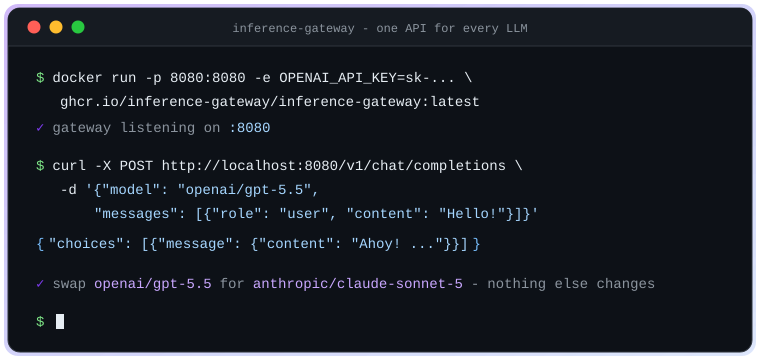

<div align="center">


# Inference Gateway

<p><strong>An open-source, cloud-native, high-performance gateway unifying multiple LLM providers behind one OpenAI-compatible API</strong></p>

<a href="https://github.com/inference-gateway/inference-gateway/actions/workflows/ci.yml?query=branch%3Amain">
</a>
<a href="https://github.com/inference-gateway/inference-gateway/releases">
</a>
<a href="https://github.com/inference-gateway/inference-gateway/blob/main/LICENSE">
</a>
<a href="https://github.com/inference-gateway/inference-gateway/blob/main/go.mod">
</a>
<a href="https://docs.inference-gateway.com">
</a>

[📖 Documentation](https://docs.inference-gateway.com) ·
[🚀 Getting Started](https://docs.inference-gateway.com/getting-started) ·
[💬 Discussions](https://github.com/orgs/inference-gateway/discussions) ·
[🐛 Issues](https://github.com/inference-gateway/inference-gateway/issues)

<br/>



</div>

The Inference Gateway is a proxy server designed to facilitate access to various
language model APIs. It allows users to interact with different language models
through a unified interface, simplifying the configuration and the process of
sending requests and receiving responses from multiple LLMs, enabling an easy
use of Mixture of Experts.

- [Key Features](#key-features)
- [Overview](#overview)
- [API Endpoints](#api-endpoints)
- [Installation](#installation)
- [Middleware Control and Bypass Mechanisms](#middleware-control-and-bypass-mechanisms)
- [Model Context Protocol (MCP) Integration](#model-context-protocol-mcp-integration)
- [Metrics and Observability](#metrics-and-observability)
- [Supported API's](#supported-apis)
- [Configuration](#configuration)
- [Examples](#examples)
- [SDKs](#sdks)
- [CLI Tool](#cli-tool)
- [Contributing](#contributing)
- [License](#license)

## Key Features

| Feature                          | Description                                                                                                                                                                                               |
| -------------------------------- | --------------------------------------------------------------------------------------------------------------------------------------------------------------------------------------------------------- |
| 🔀 **Unified API**               | One OpenAI-compatible endpoint for OpenAI, Anthropic, Groq, Cohere, Ollama, Ollama Cloud, llama.cpp, Cloudflare, DeepSeek, ElevenLabs, Google, Mistral, MiniMax, Moonshot, Nvidia, and Z.ai               |
| 🔧 **Tool-use Support**          | Function calling capabilities across supported providers with a unified API                                                                                                                               |
| 🌐 **MCP Support**               | Full Model Context Protocol integration - tools from MCP servers are discovered and exposed to LLMs automatically, and the gateway itself can serve them as an MCP server on `POST /mcp`                  |
| 🚦 **Guardrails**                | OPA/Rego policies, secret and PII detection, and an optional external guardrail service - applied to requests, responses and MCP tool calls                                                               |
| 🌊 **Streaming**                 | Real-time token streaming from all supported providers                                                                                                                                                    |
| 🖼️ **Vision / Multimodal**       | Process images alongside text with vision-capable models                                                                                                                                                  |
| ⚙️ **Environment Configuration** | Configure API keys and URLs entirely through environment variables                                                                                                                                        |
| 🐳 **Docker & Compose**          | First-class container support for easy setup and deployment                                                                                                                                               |
| ☸️ **Kubernetes Ready**          | Deploy with the [Inference Gateway Operator](https://github.com/inference-gateway/operator) and scale horizontally with [HPA](https://kubernetes.io/docs/tasks/run-application/horizontal-pod-autoscale/) |
| 📊 **OpenTelemetry**             | Prometheus metrics following the GenAI semantic conventions, plus an OTLP push endpoint                                                                                                                   |
| 🛡️ **Enterprise Ready**          | OIDC authentication, authorization, configurable timeouts, and TLS support                                                                                                                                |
| 🌿 **Lightweight**               | Essential libraries and runtime only - a ~13MB binary with minimal resource footprint                                                                                                                     |
| 🔒 **Privacy First**             | Self-hosted, zero data collection, Apache 2.0 licensed                                                                                                                                                    |
| ⌨️ **CLI Tool**                  | An [agentic command-line interface](https://github.com/inference-gateway/cli) for managing and interacting with the gateway                                                                               |

Well documented, extensively tested, and actively maintained.

## Overview

You can horizontally scale the Inference Gateway to handle multiple requests
from clients. The Inference Gateway will forward the requests to the respective
provider and return the response to the client.

**Note**: MCP middleware components can be easily toggled on/off via
environment variables (`MCP_ENABLED`) or bypassed per-request using headers
(`X-MCP-Bypass`), giving you full control over which capabilities are active.

**Note**: Vision/multimodal handling is disabled by default. With
`VISION_ENABLED=true` the gateway strips image content only from requests
targeting models its community modalities table lists as text-only input;
models the table does not cover pass images through untouched. With it
disabled, image content is forwarded to the provider untouched.

The following diagram illustrates the flow:

<div align="center">



</div>

Client is sending:

```bash
curl -X POST http://localhost:8080/v1/chat/completions
  -d '{
    "model": "openai/gpt-3.5-turbo",
    "messages": [
      {
        "role": "system",
        "content": "You are a pirate."
      },
      {
        "role": "user",
        "content": "Hello, world! How are you doing today?"
      }
    ],
  }'
```

\*\* Internally the request is proxied to OpenAI, the Inference Gateway inferring the provider by the model name.

You can also send the request explicitly using `?provider=openai` or any other supported provider in the URL.

Finally client receives:

```json
{
  "choices": [
    {
      "finish_reason": "stop",
      "index": 0,
      "message": {
        "content": "Ahoy, matey! 🏴‍☠️ The seas be wild, the sun be bright, and this here pirate be ready to conquer the day! What be yer business, landlubber? 🦜",
        "role": "assistant"
      }
    }
  ],
  "created": 1741821109,
  "id": "chatcmpl-dc24995a-7a6e-4d95-9ab3-279ed82080bb",
  "model": "N/A",
  "object": "chat.completion",
  "usage": {
    "completion_tokens": 0,
    "prompt_tokens": 0,
    "total_tokens": 0
  }
}
```

For streaming the tokens simply add to the request body `stream: true`.

## API Endpoints

| Endpoint                                        | Description                                                                                                                                                                                                                                                                                                |
| ----------------------------------------------- | ---------------------------------------------------------------------------------------------------------------------------------------------------------------------------------------------------------------------------------------------------------------------------------------------------------- |
| `GET /health`                                   | Liveness probe, no authentication required                                                                                                                                                                                                                                                                 |
| `GET /v1/models`                                | List models from every configured provider                                                                                                                                                                                                                                                                 |
| `POST /mcp`                                     | The gateway as an MCP server: one JSON-RPC 2.0 endpoint aggregating every configured MCP server, so a client configures a single entry. Opt-in via `MCP_EXPOSE=true`, otherwise the endpoint returns 403                                                                                                   |
| `GET /.well-known/oauth-protected-resource/mcp` | OAuth 2.0 Protected Resource Metadata ([RFC 9728](https://datatracker.ietf.org/doc/html/rfc9728)) for `POST /mcp`, so an MCP client discovers the authorization server on its own. No authentication required; served while `AUTH_ENABLED=true` and `MCP_EXPOSE=true`, otherwise 404                       |
| `POST /v1/chat/completions`                     | OpenAI-compatible chat completions, streaming and tools included - works with every provider                                                                                                                                                                                                               |
| `POST /v1/messages`                             | [Anthropic Messages API](https://docs.anthropic.com/en/api/messages) compatibility - the body is relayed byte-for-byte, so `cache_control` and the Anthropic SSE event envelope pass through untouched (Anthropic provider only)                                                                           |
| `POST /v1/responses`                            | [OpenAI Responses API](https://platform.openai.com/docs/api-reference/responses) compatibility, relayed byte-for-byte (OpenAI provider only)                                                                                                                                                               |
| `POST /v1/images/generations`                   | [OpenAI Images API](https://platform.openai.com/docs/api-reference/images/create) - generate images. Opt-in via `IMAGES_ENABLED=true` (OpenAI provider only)                                                                                                                                               |
| `POST /v1/images/edits`                         | Edit an image with an optional mask, `multipart/form-data`. Opt-in via `IMAGES_ENABLED=true`                                                                                                                                                                                                               |
| `POST /v1/audio/speech`                         | [OpenAI Audio Speech API](https://platform.openai.com/docs/api-reference/audio/createSpeech) - generate speech audio from text. Opt-in via `AUDIO_ENABLED=true` (OpenAI and ElevenLabs providers, or the built-in `local/qwen3-tts` engine - llama.cpp speech is a work in progress and not supported yet) |
| `POST /v1/audio/sfx`                            | Generate a sound effect from a text prompt, JSON in and raw audio out. Gateway extension with no OpenAI counterpart. Opt-in via `AUDIO_ENABLED=true` (ElevenLabs provider only)                                                                                                                            |
| `POST /v1/audio/music`                          | Compose a music clip from a text prompt, JSON in and raw audio out. Gateway extension with no OpenAI counterpart. Opt-in via `AUDIO_ENABLED=true` (ElevenLabs provider only)                                                                                                                               |
| `POST /v1/videos`                               | [OpenAI Videos API](https://platform.openai.com/docs/api-reference/videos/create) - create a video generation job, `multipart/form-data`. Opt-in via `VIDEOS_ENABLED=true` (ElevenLabs provider only)                                                                                                      |
| `GET /v1/videos/:id`                            | Poll a video generation job. The id returned by `POST /v1/videos` carries the provider (`elevenlabs:gen_abc123`) and must be sent back verbatim                                                                                                                                                            |
| `GET /v1/videos/:id/content`                    | Download the rendered video once the job is `completed`, 404 before that                                                                                                                                                                                                                                   |
| `POST /v1/metrics`                              | OTLP metrics push from clients. Opt-in via `TELEMETRY_METRICS_PUSH_ENABLED=true`                                                                                                                                                                                                                           |
| `ANY /proxy/:provider/*path`                    | Passthrough to a provider's native API with the API key injected                                                                                                                                                                                                                                           |

All `/v1` endpoints resolve the provider from the `provider/model` prefix, or
from an explicit `?provider=` query parameter.

Anthropic Messages API:

```bash
curl -X POST http://localhost:8080/v1/messages \
  -d '{
    "model": "anthropic/claude-sonnet-4-5",
    "max_tokens": 1024,
    "messages": [{"role": "user", "content": "Hello, world!"}]
  }'
```

Image generation (requires `IMAGES_ENABLED=true`):

```bash
curl -X POST http://localhost:8080/v1/images/generations \
  -d '{
    "model": "openai/gpt-image-1",
    "prompt": "A pirate ship sailing into a neon sunset",
    "n": 1,
    "size": "1024x1024"
  }'
```

Text to speech (requires `AUDIO_ENABLED=true`):

```bash
curl -X POST http://localhost:8080/v1/audio/speech \
  -d '{
    "model": "openai/gpt-4o-mini-tts",
    "input": "Ahoy! Welcome aboard the Inference Gateway.",
    "voice": "alloy"
  }' -o speech.mp3
```

Local text to speech without any provider - the reserved `local/qwen3-tts`
model is synthesized by the gateway itself via llama.cpp's `llama-tts`
(one-shot, WAV output, supports `reference_audio` voice cloning). With
`AUDIO_LOCAL_AUTO_DOWNLOAD=true` (default) the binary and GGUF models are
fetched in the background at startup into the shared `~/.infer` cache
(`~/.infer/models/tts`, `~/.infer/bin`); requests answer `503` with
`Retry-After` until assets are ready:

```bash
curl -X POST http://localhost:8080/v1/audio/speech \
  -d '{
    "model": "local/qwen3-tts",
    "input": "Ahoy! Welcome aboard the Inference Gateway."
  }' -o speech.wav
```

## Installation

> **Recommended**: For production deployments, running the Inference Gateway as
> a container is recommended. This provides better isolation, easier updates,
> and simplified configuration management. See [Docker](examples/docker-compose/)
> or [Kubernetes](examples/kubernetes/) deployment examples.
>
> **Kubernetes**: Deploy with the
> [Inference Gateway Operator](https://github.com/inference-gateway/operator),
> which reconciles a `Gateway` custom resource.

The Inference Gateway can also be installed as a standalone binary using the
provided install script or by downloading pre-built binaries from GitHub
releases.

### Using Install Script

The easiest way to install the Inference Gateway is using the automated install script:

**Install latest version:**

```bash
curl -fsSL https://raw.githubusercontent.com/inference-gateway/inference-gateway/main/install.sh | bash
```

**Install specific version:**

```bash
curl -fsSL https://raw.githubusercontent.com/inference-gateway/inference-gateway/main/install.sh | VERSION=v0.22.3 bash
```

**Install to custom directory:**

```bash
# Install to custom location
curl -fsSL https://raw.githubusercontent.com/inference-gateway/inference-gateway/main/install.sh | INSTALL_DIR=~/.local/bin bash

# Install to current directory
curl -fsSL https://raw.githubusercontent.com/inference-gateway/inference-gateway/main/install.sh | INSTALL_DIR=. bash
```

**What the script does:**

- Automatically detects your operating system (Linux/macOS) and architecture (x86_64/arm64/armv7)
- Downloads the appropriate binary from GitHub releases
- Extracts and installs to `/usr/local/bin` (or custom directory)
- Verifies the installation

> **Windows users**: The install script is a bash script and does not run on Windows
> natively. Download the Windows binary (`.zip`) directly from the
> [releases page](https://github.com/inference-gateway/inference-gateway/releases) instead.

**Supported platforms:**

- Linux: x86_64, arm64, armv7
- macOS (Darwin): x86_64 (Intel), arm64 (Apple Silicon)
- Windows: x86_64, arm64

### Manual Download

Download pre-built binaries directly from the [releases page](https://github.com/inference-gateway/inference-gateway/releases):

1. Download the appropriate archive for your platform
2. Extract the binary:

   ```bash
   tar -xzf inference-gateway_<OS>_<ARCH>.tar.gz
   ```

3. Move to a directory in your PATH:

   ```bash
   sudo mv inference-gateway /usr/local/bin/
   chmod +x /usr/local/bin/inference-gateway
   ```

### Verify Installation

```bash
inference-gateway --version
```

### Running the Gateway

Once installed, start the gateway with your configuration:

```bash
# Set required environment variables
export OPENAI_API_KEY="your-api-key"

# Start the gateway
inference-gateway
```

For detailed configuration options, see the [Configuration](#configuration) section below.

## Middleware Control and Bypass Mechanisms

The Inference Gateway uses middleware to process requests and add capabilities
like MCP (Model Context Protocol). Clients can control which middlewares are
active using bypass headers:

### Bypass Headers

- **`X-MCP-Bypass`**: Skip MCP middleware processing

### Client Control Examples

```bash
# Skip MCP middleware for direct provider access
curl -X POST http://localhost:8080/v1/chat/completions \
  -H "X-MCP-Bypass: true" \
  -d '{
    "model": "groq/llama-3-8b",
    "messages": [{"role": "user", "content": "Simple chat without tools"}]
  }'
```

### When to Use Bypass Headers

**For Performance:**

- Skip middleware processing when you don't need tool capabilities
- Reduce latency for simple chat interactions

**For Selective Features:**

- Use only standard tool calls (skip MCP): Add `X-MCP-Bypass: true`
- Direct provider access

**For Development:**

- Test middleware behavior in isolation
- Debug tool integration issues
- Ensure backward compatibility with existing applications

### How It Works Internally

`X-MCP-Bypass` is purely a client-facing opt-out: the MCP middleware
(`api/middlewares/mcp.go`) skips processing whenever the inbound request carries
the header with any non-empty value. No gateway code sets it.

**MCP Processing:**

- When tools are detected in a response, the MCP agent makes up to 10 follow-up
  requests (`MaxAgentIterations` in `internal/mcp/agent.go`)
- Those follow-ups are in-process calls on the provider
  (`provider.ChatCompletions` / `provider.StreamChatCompletions`), not HTTP
  requests back through the gateway, so the middleware chain is never re-entered

> **Note**: This bypass header only affects middleware processing. The core
> chat completions functionality remains available regardless of header values.

## Model Context Protocol (MCP) Integration

Enable MCP to automatically provide tools to LLMs without requiring clients to
manage them:

```bash
# Enable MCP and connect to tool servers (alias=url, or a bare url to derive the
# alias from the host). Tools are exposed to the model as mcp_<alias>_<tool name>
export MCP_ENABLED=true
export MCP_SERVERS="filesystem=http://filesystem-server:3001/mcp,search=http://search-server:3002/mcp"

# LLMs will automatically discover and use available tools
curl -X POST http://localhost:8080/v1/chat/completions \
  -d '{
    "model": "openai/gpt-4",
    "messages": [{"role": "user", "content": "List files in the current directory"}]
  }'
```

The gateway automatically injects available tools into requests and handles tool
execution, making external capabilities seamlessly available to any LLM.

The servers in `MCP_SERVERS` must speak MCP `2026-07-28`, the stateless
revision: the gateway sends no `initialize` and keeps no session, only
`tools/list` and `tools/call` requests carrying their protocol version. A
server that requires a legacy handshake or a session is marked unavailable.
The official SDKs serve it: TypeScript v2 (`createMcpHandler`), Go v1.7+
(a stateless Streamable HTTP handler) and Python v2; the
[MCP example](examples/docker-compose/mcp/) has a server on each of the first
two.

`MCP_EXPOSE=true` turns the gateway itself into an MCP server at
`POST /mcp`, a JSON-RPC 2.0 endpoint speaking MCP `2026-07-28` only:
`server/discover`, `tools/list` and `tools/call`, with no `initialize`
handshake and no session. It defaults to `false`, and the endpoint returns 403
until it is enabled. An agent client points one MCP entry at the gateway
and discovers every backend server, with no client config churn when servers
come and go. The client must support MCP `2026-07-28`; a legacy client gets a
`400` naming the supported version.

Every request carries its protocol version in `params._meta`, mirrored in the
`MCP-Protocol-Version` and `Mcp-Method` headers (plus `Mcp-Name` for
`tools/call`):

```bash
curl -X POST http://localhost:8080/mcp \
  -H "Content-Type: application/json" \
  -H "MCP-Protocol-Version: 2026-07-28" \
  -H "Mcp-Method: tools/list" \
  -d '{"jsonrpc":"2.0","id":1,"method":"tools/list","params":{"_meta":{"io.modelcontextprotocol/protocolVersion":"2026-07-28","io.modelcontextprotocol/clientInfo":{"name":"curl","version":"1.0"},"io.modelcontextprotocol/clientCapabilities":{}}}}'
```

`tools/list` returns the tools of the healthy servers and skips unavailable
ones; a `tools/call` routed to an unavailable server comes back as a JSON-RPC
error. Authentication applies like it does to every endpoint other than
`/health`.

With `AUTH_ENABLED=true` a client needs no pre-issued token to get started: the
`401` from `/mcp` points at the OAuth 2.0 Protected Resource Metadata
([RFC 9728](https://datatracker.ietf.org/doc/html/rfc9728)) document MCP
`2026-07-28` requires, and the document names the issuer to authenticate with.

```bash
curl -i -X POST http://localhost:8080/mcp
# HTTP/1.1 401 Unauthorized
# WWW-Authenticate: Bearer realm="inference-gateway", resource_metadata="http://localhost:8080/.well-known/oauth-protected-resource/mcp"

curl http://localhost:8080/.well-known/oauth-protected-resource/mcp
# {"resource":"http://localhost:8080/mcp","authorization_servers":["http://keycloak:8080/realms/inference-gateway-realm"],"bearer_methods_supported":["header"]}
```

The document is served without a token, like `/health`, since a client fetches
it precisely because it has none yet. `resource` is the request's scheme
(honouring `X-Forwarded-Proto`) and `Host` with `/mcp` appended; behind an
ingress that rewrites either, set `MCP_RESOURCE_URL` to the canonical public
URL. When the IdP stamps that resource into the token's `aud` (RFC 8707), list
the same value in `AUTH_OIDC_AUDIENCE`.

A `tools/call` runs through the same tool guardrails as the chat-completions
agent loop - `tool_args` before the upstream call and `tool_output` after it -
and is counted under `inference_gateway.tool_calls` with
`gen_ai.tool.type=mcp` and traced with an `execute_tool <name>` span. A policy
block (at any phase, including `pre_call`) answers `403` with a JSON-RPC error
envelope using code `-32001`, so a client can tell a policy refusal from an
upstream failure (`-32603`).

> **Learn more**:
> [Model Context Protocol Documentation](https://modelcontextprotocol.io/) |
> [MCP Integration Example](examples/docker-compose/mcp/)

## Metrics and Observability

The Inference Gateway provides comprehensive OpenTelemetry metrics for
monitoring performance, usage, and function/tool call activity. Metrics are
automatically exported to Prometheus format and available on port 9464 by
default.

### Enabling Metrics

```bash
# Enable telemetry and set metrics port (default: 9464)
export TELEMETRY_ENABLED=true
export TELEMETRY_METRICS_PORT=9464

# Access metrics endpoint
curl http://localhost:9464/metrics
```

### Available Metrics

Metrics follow the [OpenTelemetry GenAI semantic conventions](https://opentelemetry.io/docs/specs/semconv/gen-ai/).
Every series carries a `source` label: `gateway` for gateway-observed traffic, or a client-supplied value
(e.g. `claude-code-subscription`) for pushed metrics.

| Metric                                                | Type      | Description                                                             |
| ----------------------------------------------------- | --------- | ----------------------------------------------------------------------- |
| `gen_ai_client_token_usage`                           | Histogram | Token usage; `gen_ai_token_type` is `input` or `output`                 |
| `gen_ai_server_request_duration_seconds`              | Histogram | End-to-end request duration in seconds; `error_type` set only on errors |
| `gen_ai_execute_tool_duration_seconds`                | Histogram | Tool execution duration in seconds (fed via the push endpoint)          |
| `gen_ai_client_operation_duration_seconds`            | Histogram | Client-side operation duration (push-only)                              |
| `gen_ai_client_operation_time_to_first_chunk_seconds` | Histogram | Time to first chunk (push-only)                                         |
| `gen_ai_server_time_to_first_token_seconds`           | Histogram | Time to first token (push-only)                                         |
| `inference_gateway_tool_calls_total`                  | Counter   | Total function/tool calls                                               |

**Common labels**: `gen_ai_provider_name`, `gen_ai_request_model`, `gen_ai_operation_name`, `source`;
tool metrics add `gen_ai_tool_type` and `gen_ai_tool_name`; token usage adds `gen_ai_token_type`;
`error_type` (HTTP status string) is present only on errors.

```promql
# Input tokens used by OpenAI models in the last hour
sum(increase(gen_ai_client_token_usage_sum{gen_ai_provider_name="openai", gen_ai_token_type="input"}[1h])) by (gen_ai_request_model)

# 95th percentile request latency by provider (seconds)
histogram_quantile(0.95, sum(rate(gen_ai_server_request_duration_seconds_bucket{gen_ai_provider_name=~"openai|anthropic"}[5m])) by (gen_ai_provider_name, le))

# Error rate percentage by provider
100 * sum(rate(gen_ai_server_request_duration_seconds_count{error_type!=""}[5m])) by (gen_ai_provider_name) / sum(rate(gen_ai_server_request_duration_seconds_count[5m])) by (gen_ai_provider_name)

# Most frequently used tools
topk(10, sum(increase(inference_gateway_tool_calls_total[1h])) by (gen_ai_tool_name))
```

### Pushing Metrics (OTLP)

Clients such as the infer CLI can push their own metrics (e.g. token usage from subscription-based sessions)
to the gateway. Enable the opt-in endpoint with `TELEMETRY_METRICS_PUSH_ENABLED=true` (alongside
`TELEMETRY_ENABLED=true`) and POST OTLP JSON to `POST /v1/metrics`; pushed series are exposed on the same
Prometheus endpoint with the client-supplied `source` label.
See [examples/docker-compose/monitoring](examples/docker-compose/monitoring/README.md) for a full example.

### Monitoring Setup

#### Docker Compose Example

Complete monitoring stack with Grafana dashboards:

```bash
cd examples/docker-compose/monitoring/
cp .env.example .env  # Configure your API keys
docker compose up -d

# Access Grafana at http://localhost:3000 (admin/admin)
```

#### Kubernetes Example

Enterprise-ready monitoring with Prometheus Operator:

```bash
cd examples/kubernetes/monitoring/
task deploy-infrastructure
task deploy-inference-gateway

# Access via port-forward or ingress
kubectl port-forward svc/grafana-service 3000:3000
```

### Grafana Dashboard

The included Grafana dashboard provides:

- **Real-time Metrics**: 5-second refresh rate for immediate feedback
- **Tool Call Analytics**: Success rates, duration analysis, and failure
  tracking
- **Provider Comparison**: Performance metrics across all supported providers
- **Usage Insights**: Token consumption patterns and cost analysis
- **Error Monitoring**: Failed requests and tool call error classification

> **Learn more**:
> [Docker Compose Monitoring](examples/docker-compose/monitoring/) |
> [Kubernetes Monitoring](examples/kubernetes/monitoring/) |
> [OpenTelemetry Documentation](https://opentelemetry.io/)

## Supported API's

- [OpenAI](https://platform.openai.com/)
- [Ollama](https://ollama.com/)
- [Ollama Cloud](https://ollama.com/cloud) (Preview)
- [llama.cpp](https://github.com/ggml-org/llama.cpp)
- [Groq](https://console.groq.com/)
- [Cloudflare](https://www.cloudflare.com/)
- [Cohere](https://docs.cohere.com/docs/the-cohere-platform)
- [Anthropic](https://docs.anthropic.com/en/api/getting-started)
- [DeepSeek](https://api-docs.deepseek.com/)
- [Google](https://aistudio.google.com/)
- [Mistral](https://mistral.ai/)
- [MiniMax](https://platform.minimax.io/docs)
- [Moonshot](https://platform.moonshot.ai/)
- [Nvidia](https://build.nvidia.com/)
- [Z.ai](https://docs.z.ai/)

## Configuration

The Inference Gateway can be configured using environment variables. The
following [environment variables](./Configurations.md) are supported.

### Vision/Multimodal Support

To enable vision handling for requests carrying images alongside text:

```bash
VISION_ENABLED=true
```

**Note**: Vision handling is disabled by default. When `VISION_ENABLED=true`,
the gateway looks the target model up in its community modalities table
(`providers/core/community_modalities.json`, synced from models.dev): image
content parts are stripped from the request (leaving text only) only when the
table says the model accepts text-only input. Everything else - vision models
in the table and any model the table does not cover - is passed through
unchanged, so an unrecognized model is never silently stripped. When disabled,
the gateway does not inspect image content at all and the provider decides how
to handle it.

The table is not an allow-list of providers: it covers whichever models
models.dev publishes. Ollama models, for example, have no entries at all, so
LLaVA and Llama 3.2 Vision work through the permissive default rather than
through recognition.

## Examples

- Using [Docker Compose](examples/docker-compose/)
  - [Basic setup](examples/docker-compose/basic/) - Simple configuration with a
    single provider
  - [MCP Integration](examples/docker-compose/mcp/) - Model Context Protocol with
    multiple tool servers
  - [Hybrid deployment](examples/docker-compose/hybrid/) - Multiple providers
    (cloud + local)
  - [Keycloak](examples/docker-compose/auth-keycloak/) - OIDC authentication and
    guardrails authorization setup
  - [Entra ID](examples/docker-compose/auth-entra/), [Google Cloud](examples/docker-compose/auth-gcp/)
    and [Amazon Cognito](examples/docker-compose/auth-cognito/) - the same setup against cloud identity providers
  - [Tools](examples/docker-compose/tools/) - Tool integration examples
  - [Guardrails](examples/docker-compose/guardrails/) - OPA/Rego request
    guardrails
  - [Monitoring](examples/docker-compose/monitoring/) - Prometheus and
    Grafana metrics stack
- Using [Kubernetes](examples/kubernetes/)
  - [Basic setup](examples/kubernetes/basic/) - Simple Kubernetes deployment
  - [MCP Integration](examples/kubernetes/mcp/) - Model Context Protocol in
    Kubernetes
  - [Agent deployment](examples/kubernetes/agent/) - Standalone agent deployment
  - [Hybrid deployment](examples/kubernetes/hybrid/) - Multiple providers in
    Kubernetes
  - [Keycloak](examples/kubernetes/auth-keycloak/) - OIDC authentication
  - [Entra ID](examples/kubernetes/auth-entra/), [Google Cloud](examples/kubernetes/auth-gcp/)
    and [Amazon Cognito](examples/kubernetes/auth-cognito/) - OIDC authentication with cloud identity providers
    in Kubernetes
  - [Guardrails](examples/kubernetes/guardrails/) - OPA/Rego guardrails via
    the operator
  - [Monitoring](examples/kubernetes/monitoring/) - Observability and monitoring
    setup
  - [TLS setup](examples/kubernetes/tls/) - TLS/SSL configuration
- Using standard [REST endpoints](examples/rest-endpoints/)

## SDKs

More SDKs could be generated using the OpenAPI specification. The following
SDKs are currently available:

- [Typescript](https://github.com/inference-gateway/typescript-sdk)
- [Rust](https://github.com/inference-gateway/rust-sdk)
- [Go](https://github.com/inference-gateway/go-sdk)
- [Python](https://github.com/inference-gateway/python-sdk)

## CLI Tool

The Inference Gateway CLI provides a powerful command-line interface for
managing and interacting with the Inference Gateway. It offers tools for
configuration, monitoring, and management of inference services.

### CLI Key Features

- **Status Monitoring**: Check gateway health and resource usage
- **Interactive Chat**: Chat with models using an interactive interface
- **Configuration Management**: Manage gateway settings via YAML config
- **Project Initialization**: Set up local project configurations
- **Tool Execution**: LLMs can execute whitelisted commands and tools

### CLI Installation

#### Using Go Install

```bash
go install github.com/inference-gateway/cli@latest
```

#### Using CLI Install Script

```bash
curl -fsSL https://raw.githubusercontent.com/inference-gateway/cli/main/install.sh | bash
```

#### Manual CLI Download

Download the latest release from the
[releases page](https://github.com/inference-gateway/cli/releases).

### Quick Start

1. **Initialize project configuration:**

   ```bash
   infer init
   ```

2. **Check gateway status:**

   ```bash
   infer status
   ```

3. **Start an interactive chat:**

   ```bash
   infer chat
   ```

For more details, see the [CLI documentation](https://github.com/inference-gateway/cli).

## License

This project is licensed under the Apache 2.0 License.

## Contributing

Found a bug, missing provider, or have a feature in mind?  
You're more than welcome to submit pull requests or open issues for any fixes, improvements, or new ideas!

Please read the [CONTRIBUTING.md](./CONTRIBUTING.md) for more details.

## Motivation

My motivation is to build AI Agents without being tied to a single vendor. By
avoiding vendor lock-in and supporting self-hosted LLMs from a single interface,
organizations gain both portability and data privacy. You can choose to consume
LLMs from a cloud provider or run them entirely offline with Ollama.
