<h1 align="center">Inference Gateway</h1>

<p align="center">
  <!-- CI Status Badge -->
  <a href="https://github.com/inference-gateway/inference-gateway/actions/workflows/ci.yml?query=branch%3Amain">
    
  </a>
  <!-- Version Badge -->
  <a href="https://github.com/inference-gateway/inference-gateway/releases">
    
  </a>
  <!-- License Badge -->
  <a href="https://github.com/inference-gateway/inference-gateway/blob/main/LICENSE">
    
  </a>
</p>

The Inference Gateway is a proxy server designed to facilitate access to various language model APIs. It allows users to interact with different language models through a unified interface, simplifying the configuration and the process of sending requests and receiving responses from multiple LLMs, enabling an easy use of Mixture of Experts.

- [Key Features](#key-features)
- [Overview](#overview)
- [Model Context Protocol (MCP) Integration](#model-context-protocol-mcp-integration)
- [Supported API's](#supported-apis)
- [Configuration](#configuration)
- [Examples](#examples)
- [SDKs](#sdks)
- [License](#license)
- [Contributing](#contributing)
- [Motivation](#motivation)

## Key Features

- 📜 **Open Source**: Available under the MIT License.
- 🚀 **Unified API Access**: Proxy requests to multiple language model APIs, including OpenAI, Ollama, Groq, Cohere etc.
- ⚙️ **Environment Configuration**: Easily configure API keys and URLs through environment variables.
- 🔧 **Tool-use Support**: Enable function calling capabilities across supported providers with a unified API.
- 🌐 **MCP Support**: Full Model Context Protocol integration - automatically discover and expose tools from MCP servers to LLMs without client-side tool management.
- 🌊 **Streaming Responses**: Stream tokens in real-time as they're generated from language models.
- 🖥️ **Web Interface**: Access through a modern web UI for easy interaction and management.
- 🐳 **Docker Support**: Use Docker and Docker Compose for easy setup and deployment.
- ☸️ **Kubernetes Support**: Ready for deployment in Kubernetes environments.
- 📊 **OpenTelemetry**: Monitor and analyze performance.
- 🛡️ **Production Ready**: Built with production in mind, with configurable timeouts and TLS support.
- 🌿 **Lightweight**: Includes only essential libraries and runtime, resulting in smaller size binary of ~10.8MB.
- 📉 **Minimal Resource Consumption**: Designed to consume minimal resources and have a lower footprint.
- 📚 **Documentation**: Well documented with examples and guides.
- 🧪 **Tested**: Extensively tested with unit tests and integration tests.
- 🛠️ **Maintained**: Actively maintained and developed.
- 📈 **Scalable**: Easily scalable and can be used in a distributed environment - with <a href="https://kubernetes.io/docs/tasks/run-application/horizontal-pod-autoscale/" target="_blank">HPA</a> in Kubernetes.
- 🔒 **Compliance** and Data Privacy: This project does not collect data or analytics, ensuring compliance and data privacy.
- 🏠 **Self-Hosted**: Can be self-hosted for complete control over the deployment environment.

## Overview

You can horizontally scale the Inference Gateway to handle multiple requests from clients. The Inference Gateway will forward the requests to the respective provider and return the response to the client. The following diagram illustrates the flow:

```mermaid
%%{init: {'theme': 'base', 'themeVariables': { 'primaryColor': '#326CE5', 'primaryTextColor': '#fff', 'lineColor': '#5D8AA8', 'secondaryColor': '#006100' }, 'fontFamily': 'Arial', 'flowchart': {'nodeSpacing': 50, 'rankSpacing': 70, 'padding': 15}}}%%


graph TD
    %% Client nodes
    A["👥 Clients / 🤖 Agents"] --> |POST /v1/chat/completions| Auth
    UI["💻 Web UI"] --> |API requests| Auth

    %% Auth node
    Auth["🔒 Optional OIDC"] --> |Auth?| IG1
    Auth --> |Auth?| IG2
    Auth --> |Auth?| IG3

    %% Gateway nodes
    IG1["🖥️ Inference Gateway"] --> P
    IG2["🖥️ Inference Gateway"] --> P
    IG3["🖥️ Inference Gateway"] --> P

    %% MCP Layer
    P["🔌 Proxy Gateway"] --> MCP["🌐 MCP"]
    P --> Direct["Direct Providers"]

    %% Providers
    MCP --> C["🦙 Ollama"]
    MCP --> D["🚀 Groq"]
    MCP --> E["☁️ OpenAI"]
    Direct --> G["⚡ Cloudflare"]
    Direct --> H1["💬 Cohere"]
    Direct --> H2["🧠 Anthropic"]
    Direct --> H3["🐋 DeepSeek"]

    %% Define styles
    classDef client fill:#9370DB,stroke:#333,stroke-width:1px,color:white;
    classDef auth fill:#F5A800,stroke:#333,stroke-width:1px,color:black;
    classDef gateway fill:#326CE5,stroke:#fff,stroke-width:1px,color:white;
    classDef provider fill:#32CD32,stroke:#333,stroke-width:1px,color:white;
    classDef ui fill:#FF6B6B,stroke:#333,stroke-width:1px,color:white;

    %% Apply styles
    class A client;
    class UI ui;
    class Auth auth;
    class IG1,IG2,IG3,P gateway;
    class C,D,E,G,H1,H2,H3 provider;
    class MCP mcp;
    class Direct direct;
```



Client is sending:

```bash
curl -X POST http://localhost:8080/v1/chat/completions
  -d '{
    "model": "openai/gpt-3.5-turbo",
    "messages": [
      {
        "role": "system",
        "content": "You are a pirate."
      },
      {
        "role": "user",
        "content": "Hello, world! How are you doing today?"
      }
    ],
  }'
```

\*\* Internally the request is proxied to OpenAI, the Inference Gateway inferring the provider by the model name.

You can also send the request explicitly using `?provider=openai` or any other supported provider in the URL.

Finally client receives:

```json
{
  "choices": [
    {
      "finish_reason": "stop",
      "index": 0,
      "message": {
        "content": "Ahoy, matey! 🏴‍☠️ The seas be wild, the sun be bright, and this here pirate be ready to conquer the day! What be yer business, landlubber? 🦜",
        "role": "assistant"
      }
    }
  ],
  "created": 1741821109,
  "id": "chatcmpl-dc24995a-7a6e-4d95-9ab3-279ed82080bb",
  "model": "N/A",
  "object": "chat.completion",
  "usage": {
    "completion_tokens": 0,
    "prompt_tokens": 0,
    "total_tokens": 0
  }
}
```

For streaming the tokens simply add to the request body `stream: true`.

## Model Context Protocol (MCP) Integration

Enable MCP to automatically provide tools to LLMs without requiring clients to manage them:

```bash
# Enable MCP and connect to tool servers
export MCP_ENABLE=true
export MCP_SERVERS="http://filesystem-server:3001,http://search-server:3002"

# LLMs will automatically discover and use available tools
curl -X POST http://localhost:8080/v1/chat/completions \
  -d '{
    "model": "openai/gpt-4",
    "messages": [{"role": "user", "content": "List files in the current directory"}]
  }'
```

The gateway automatically injects available tools into requests and handles tool execution, making external capabilities seamlessly available to any LLM.

> **Learn more**: [Model Context Protocol Documentation](https://modelcontextprotocol.io/) | [MCP Integration Example](examples/docker-compose/mcp/)

## Supported API's

- [OpenAI](https://platform.openai.com/)
- [Ollama](https://ollama.com/)
- [Groq](https://console.groq.com/)
- [Cloudflare](https://www.cloudflare.com/)
- [Cohere](https://docs.cohere.com/docs/the-cohere-platform)
- [Anthropic](https://docs.anthropic.com/en/api/getting-started)
- [DeepSeek](https://api-docs.deepseek.com/)

## Configuration

The Inference Gateway can be configured using environment variables. The following [environment variables](./Configurations.md) are supported.

## Examples

- Using [Docker Compose](examples/docker-compose/)
  - [Basic setup](examples/docker-compose/basic/) - Simple configuration with a single provider
  - [MCP Integration](examples/docker-compose/mcp/) - Model Context Protocol with multiple tool servers
  - [Hybrid deployment](examples/docker-compose/hybrid/) - Multiple providers (cloud + local)
  - [Authentication](examples/docker-compose/authentication/) - OIDC authentication setup
  - [Web UI](examples/docker-compose/ui/) - Complete setup with web interface
- Using [Kubernetes](examples/kubernetes/)
- Using standard [REST endpoints](examples/rest-endpoints/)

## SDKs

More SDKs could be generated using the OpenAPI specification. The following SDKs are currently available:

- [Typescript](https://github.com/inference-gateway/typescript-sdk)
- [Rust](https://github.com/inference-gateway/rust-sdk)
- [Go](https://github.com/inference-gateway/go-sdk)
- [Python](https://github.com/inference-gateway/python-sdk)

## License

This project is licensed under the MIT License.

## Contributing

Found a bug, missing provider, or have a feature in mind?  
You're more than welcome to submit pull requests or open issues for any fixes, improvements, or new ideas!

Please read the [CONTRIBUTING.md](./CONTRIBUTING.md) for more details.

## Motivation

My motivation is to build AI Agents without being tied to a single vendor. By avoiding vendor lock-in and supporting self-hosted LLMs from a single interface, organizations gain both portability and data privacy. You can choose to consume LLMs from a cloud provider or run them entirely offline with Ollama.
