<h1 align="center">Inference Gateway</h1>

<p align="center">
  <!-- CI Status Badge -->
  <a href="https://github.com/inference-gateway/inference-gateway/actions/workflows/ci.yml?query=branch%3Amain">
    
  </a>
  <!-- Version Badge -->
  <a href="https://github.com/inference-gateway/inference-gateway/releases">
    
  </a>
  <!-- License Badge -->
  <a href="https://github.com/inference-gateway/inference-gateway/blob/main/LICENSE">
    
  </a>
</p>

The Inference Gateway is a proxy server designed to facilitate access to various language model APIs. It allows users to interact with different language models through a unified interface, simplifying the configuration and the process of sending requests and receiving responses from multiple LLMs, enabling an easy use of Mixture of Experts.

- [Key Features](#key-features)
- [Overview](#overview)
- [Middleware Control and Bypass Mechanisms](#middleware-control-and-bypass-mechanisms)
  - [Bypass Headers](#bypass-headers)
  - [Client Control Examples](#client-control-examples)
  - [When to Use Bypass Headers](#when-to-use-bypass-headers)
  - [How It Works Internally](#how-it-works-internally)
- [Model Context Protocol (MCP) Integration](#model-context-protocol-mcp-integration)
- [Metrics and Observability](#metrics-and-observability)
  - [Enabling Metrics](#enabling-metrics)
  - [Available Metrics](#available-metrics)
    - [Token Usage Metrics](#token-usage-metrics)
    - [Request/Response Metrics](#requestresponse-metrics)
    - [Function/Tool Call Metrics](#functiontool-call-metrics)
  - [Monitoring Setup](#monitoring-setup)
    - [Docker Compose Example](#docker-compose-example)
    - [Kubernetes Example](#kubernetes-example)
  - [Histogram Boundaries](#histogram-boundaries)
  - [Grafana Dashboard](#grafana-dashboard)
  - [Prometheus Configuration](#prometheus-configuration)
  - [Provider Detection](#provider-detection)
- [Supported API's](#supported-apis)
- [Development Environment](#development-environment)
  - [Prerequisites](#prerequisites)
  - [Quick Start](#quick-start)
  - [Available Tools](#available-tools)
  - [Common Commands](#common-commands)
  - [Environment Details](#environment-details)
- [Installation](#installation)
  - [Using Install Script](#using-install-script)
  - [Manual Download](#manual-download)
  - [Verify Installation](#verify-installation)
  - [Running the Gateway](#running-the-gateway)
- [Configuration](#configuration)
- [Examples](#examples)
- [SDKs](#sdks)
- [CLI Tool](#cli-tool)
  - [Key Features](#key-features-1)
  - [Installation](#installation)
    - [Using Go Install](#using-go-install)
    - [Using Install Script](#using-install-script)
    - [Manual Download](#manual-download)
  - [Quick Start](#quick-start-1)
- [License](#license)
- [Contributing](#contributing)
- [Motivation](#motivation)

## Key Features

- 📜 **Open Source**: Available under the MIT License.
- 🚀 **Unified API Access**: Proxy requests to multiple language model APIs, including OpenAI, Ollama, Ollama Cloud, Groq, Cohere etc.
- ⚙️ **Environment Configuration**: Easily configure API keys and URLs through environment variables.
- 🔧 **Tool-use Support**: Enable function calling capabilities across supported providers with a unified API.
- 🌐 **MCP Support**: Full Model Context Protocol integration - automatically discover and expose tools from MCP servers to LLMs without client-side tool management.
- 🌊 **Streaming Responses**: Stream tokens in real-time as they're generated from language models.
- 🖼️ **Vision/Multimodal Support**: Process images alongside text with vision-capable models.
- 🖥️ **Web Interface**: Access through a modern web UI for easy interaction and management.
- 🐳 **Docker Support**: Use Docker and Docker Compose for easy setup and deployment.
- ☸️ **Kubernetes Support**: Ready for deployment in Kubernetes environments.
- 📊 **OpenTelemetry**: Monitor and analyze performance.
- 🛡️ **Production Ready**: Built with production in mind, with configurable timeouts and TLS support.
- 🌿 **Lightweight**: Includes only essential libraries and runtime, resulting in smaller size binary of ~10.8MB.
- 📉 **Minimal Resource Consumption**: Designed to consume minimal resources and have a lower footprint.
- 📚 **Documentation**: Well documented with examples and guides.
- 🧪 **Tested**: Extensively tested with unit tests and integration tests.
- 🛠️ **Maintained**: Actively maintained and developed.
- 📈 **Scalable**: Easily scalable and can be used in a distributed environment - with <a href="https://kubernetes.io/docs/tasks/run-application/horizontal-pod-autoscale/" target="_blank">HPA</a> in Kubernetes.
- 🔒 **Compliance** and Data Privacy: This project does not collect data or analytics, ensuring compliance and data privacy.
- 🏠 **Self-Hosted**: Can be self-hosted for complete control over the deployment environment.
- ⌨️ **CLI Tool**: Improved command-line interface for managing and interacting with the Inference Gateway

## Overview

You can horizontally scale the Inference Gateway to handle multiple requests from clients. The Inference Gateway will forward the requests to the respective provider and return the response to the client.

**Note**: MCP middleware components can be easily toggled on/off via environment variables (`MCP_ENABLE`) or bypassed per-request using headers (`X-MCP-Bypass`), giving you full control over which capabilities are active.

**Note**: Vision/multimodal support is disabled by default for security and performance. To enable image processing with vision-capable models (GPT-4o, Claude 4.5, Gemini 2.5, etc.), set `ENABLE_VISION=true` in your environment configuration.

The following diagram illustrates the flow:

```mermaid
%%{init: {'theme': 'base', 'themeVariables': { 'primaryColor': '#326CE5', 'primaryTextColor': '#fff', 'lineColor': '#5D8AA8', 'secondaryColor': '#006100' }, 'fontFamily': 'Arial', 'flowchart': {'nodeSpacing': 50, 'rankSpacing': 70, 'padding': 15}}}%%


graph TD
    %% Client nodes
    A["👥 Clients / 🤖 Agents"] --> |POST /v1/chat/completions| Auth
    UI["💻 Web UI"] --> |API requests| Auth

    %% Auth node
    Auth["🔒 Optional OIDC"] --> |Auth?| IG1
    Auth --> |Auth?| IG2
    Auth --> |Auth?| IG3

    %% Gateway nodes
    IG1["🖥️ Inference Gateway"] --> P
    IG2["🖥️ Inference Gateway"] --> P
    IG3["🖥️ Inference Gateway"] --> P

    %% Middleware Processing and Direct Routing
    P["🔌 Proxy Gateway"] --> MCP["🌐 MCP Middleware"]
    P --> |"Direct routing bypassing middleware"| Direct["🔌 Direct Providers"]
    MCP --> |"Middleware chain complete"| Providers["🤖 LLM Providers"]

    %% MCP Tool Servers
    MCP --> MCP1["📁 File System Server"]
    MCP --> MCP2["🔍 Search Server"]
    MCP --> MCP3["🌐 Web Server"]

    %% LLM Providers (Middleware Enhanced)
    Providers --> C1["🦙 Ollama"]
    Providers --> D1["🚀 Groq"]
    Providers --> E1["☁️ OpenAI"]

    %% Direct Providers (Bypass Middleware)
    Direct --> C["🦙 Ollama"]
    Direct --> D["🚀 Groq"]
    Direct --> E["☁️ OpenAI"]
    Direct --> G["⚡ Cloudflare"]
    Direct --> H1["💬 Cohere"]
    Direct --> H2["🧠 Anthropic"]
    Direct --> H3["🐋 DeepSeek"]

    %% Define styles
    classDef client fill:#9370DB,stroke:#333,stroke-width:1px,color:white;
    classDef auth fill:#F5A800,stroke:#333,stroke-width:1px,color:black;
    classDef gateway fill:#326CE5,stroke:#fff,stroke-width:1px,color:white;
    classDef provider fill:#32CD32,stroke:#333,stroke-width:1px,color:white;
    classDef ui fill:#FF6B6B,stroke:#333,stroke-width:1px,color:white;
    classDef mcp fill:#FF69B4,stroke:#333,stroke-width:1px,color:white;

    %% Apply styles
    class A client;
    class UI ui;
    class Auth auth;
    class IG1,IG2,IG3,P gateway;
    class C,D,E,G,H1,H2,H3,C1,D1,E1,Providers provider;
    class MCP,MCP1,MCP2,MCP3 mcp;
    class Direct direct;
```



Client is sending:

```bash
curl -X POST http://localhost:8080/v1/chat/completions
  -d '{
    "model": "openai/gpt-3.5-turbo",
    "messages": [
      {
        "role": "system",
        "content": "You are a pirate."
      },
      {
        "role": "user",
        "content": "Hello, world! How are you doing today?"
      }
    ],
  }'
```

\*\* Internally the request is proxied to OpenAI, the Inference Gateway inferring the provider by the model name.

You can also send the request explicitly using `?provider=openai` or any other supported provider in the URL.

Finally client receives:

```json
{
  "choices": [
    {
      "finish_reason": "stop",
      "index": 0,
      "message": {
        "content": "Ahoy, matey! 🏴‍☠️ The seas be wild, the sun be bright, and this here pirate be ready to conquer the day! What be yer business, landlubber? 🦜",
        "role": "assistant"
      }
    }
  ],
  "created": 1741821109,
  "id": "chatcmpl-dc24995a-7a6e-4d95-9ab3-279ed82080bb",
  "model": "N/A",
  "object": "chat.completion",
  "usage": {
    "completion_tokens": 0,
    "prompt_tokens": 0,
    "total_tokens": 0
  }
}
```

For streaming the tokens simply add to the request body `stream: true`.

## Middleware Control and Bypass Mechanisms

The Inference Gateway uses middleware to process requests and add capabilities like MCP (Model Context Protocol). Clients can control which middlewares are active using bypass headers:

### Bypass Headers

- **`X-MCP-Bypass`**: Skip MCP middleware processing

### Client Control Examples

```bash
# Use only standard tool calls (skip MCP)
curl -X POST http://localhost:8080/v1/chat/completions \
  -H "X-MCP-Bypass: true" \
  -d '{
    "model": "anthropic/claude-3-haiku",
    "messages": [{"role": "user", "content": "Connect to external agents"}]
  }'

# Skip both middlewares for direct provider access
curl -X POST http://localhost:8080/v1/chat/completions \
  -H "X-MCP-Bypass: true" \
  -d '{
    "model": "groq/llama-3-8b",
    "messages": [{"role": "user", "content": "Simple chat without tools"}]
  }'
```

### When to Use Bypass Headers

**For Performance:**

- Skip middleware processing when you don't need tool capabilities
- Reduce latency for simple chat interactions

**For Selective Features:**

- Use only standard tool calls (skip MCP): Add `X-MCP-Bypass: true`
- Direct provider access

**For Development:**

- Test middleware behavior in isolation
- Debug tool integration issues
- Ensure backward compatibility with existing applications

### How It Works Internally

The middlewares use these same headers to prevent infinite loops during their operation:

**MCP Processing:**

- When tools are detected in a response, the MCP agent makes up to 10 follow-up requests
- Each follow-up request includes `X-MCP-Bypass: true` to skip middleware re-processing
- This allows the agent to iterate without creating circular calls

> **Note**: These bypass headers only affect middleware processing. The core chat completions functionality remains available regardless of header values.

## Model Context Protocol (MCP) Integration

Enable MCP to automatically provide tools to LLMs without requiring clients to manage them:

```bash
# Enable MCP and connect to tool servers
export MCP_ENABLE=true
export MCP_SERVERS="http://filesystem-server:3001/mcp,http://search-server:3002/mcp"

# LLMs will automatically discover and use available tools
curl -X POST http://localhost:8080/v1/chat/completions \
  -d '{
    "model": "openai/gpt-4",
    "messages": [{"role": "user", "content": "List files in the current directory"}]
  }'
```

The gateway automatically injects available tools into requests and handles tool execution, making external capabilities seamlessly available to any LLM.

> **Learn more**: [Model Context Protocol Documentation](https://modelcontextprotocol.io/) | [MCP Integration Example](examples/docker-compose/mcp/)

## Metrics and Observability

The Inference Gateway provides comprehensive OpenTelemetry metrics for monitoring performance, usage, and function/tool call activity. Metrics are automatically exported to Prometheus format and available on port 9464 by default.

### Enabling Metrics

```bash
# Enable telemetry and set metrics port (default: 9464)
export TELEMETRY_ENABLE=true
export TELEMETRY_METRICS_PORT=9464

# Access metrics endpoint
curl http://localhost:9464/metrics
```

### Available Metrics

#### Token Usage Metrics

Track token consumption across different providers and models:

- **`llm_usage_prompt_tokens_total`** - Counter for prompt tokens consumed
- **`llm_usage_completion_tokens_total`** - Counter for completion tokens generated
- **`llm_usage_total_tokens_total`** - Counter for total token usage

**Labels**: `provider`, `model`

```promql
# Total tokens used by OpenAI models in the last hour
sum(increase(llm_usage_total_tokens_total{provider="openai"}[1h])) by (model)
```

#### Request/Response Metrics

Monitor API performance and reliability:

- **`llm_requests_total`** - Counter for total requests processed
- **`llm_responses_total`** - Counter for responses by HTTP status code
- **`llm_request_duration`** - Histogram for end-to-end request duration (milliseconds)

**Labels**: `provider`, `request_method`, `request_path`, `status_code` (responses only)

```promql
# 95th percentile request latency by provider
histogram_quantile(0.95, sum(rate(llm_request_duration_bucket{provider=~"openai|anthropic"}[5m])) by (provider, le))

# Error rate percentage by provider
100 * sum(rate(llm_responses_total{status_code!~"2.."}[5m])) by (provider) / sum(rate(llm_responses_total[5m])) by (provider)
```

#### Function/Tool Call Metrics

Comprehensive tracking of tool executions for MCP, and standard function calls:

- **`llm_tool_calls_total`** - Counter for total function/tool calls executed
- **`llm_tool_calls_success_total`** - Counter for successful tool executions
- **`llm_tool_calls_failure_total`** - Counter for failed tool executions
- **`llm_tool_call_duration`** - Histogram for tool execution duration (milliseconds)

**Labels**: `provider`, `model`, `tool_type`, `tool_name`, `error_type` (failures only)

**Tool Types**:

- `mcp` - Model Context Protocol tools (prefix: `mcp_`)
- `standard_tool_use` - Other function calls

```promql
# Tool call success rate by type
100 * sum(rate(llm_tool_calls_success_total[5m])) by (tool_type) / sum(rate(llm_tool_calls_total[5m])) by (tool_type)

# Average tool execution time by provider
sum(rate(llm_tool_call_duration_sum[5m])) by (provider) / sum(rate(llm_tool_call_duration_count[5m])) by (provider)

# Most frequently used tools
topk(10, sum(increase(llm_tool_calls_total[1h])) by (tool_name))
```

### Monitoring Setup

#### Docker Compose Example

Complete monitoring stack with Grafana dashboards:

```bash
cd examples/docker-compose/monitoring/
cp .env.example .env  # Configure your API keys
docker compose up -d

# Access Grafana at http://localhost:3000 (admin/admin)
```

#### Kubernetes Example

Production-ready monitoring with Prometheus Operator:

```bash
cd examples/kubernetes/monitoring/
task deploy-infrastructure
task deploy-inference-gateway

# Access via port-forward or ingress
kubectl port-forward svc/grafana-service 3000:3000
```

### Histogram Boundaries

Request and tool call duration histograms use optimized boundaries for millisecond precision:

```
[1, 5, 10, 25, 50, 75, 100, 250, 500, 750, 1000, 2500, 5000, 7500, 10000] ms
```

### Grafana Dashboard

The included Grafana dashboard provides:

- **Real-time Metrics**: 5-second refresh rate for immediate feedback
- **Tool Call Analytics**: Success rates, duration analysis, and failure tracking
- **Provider Comparison**: Performance metrics across all supported providers
- **Usage Insights**: Token consumption patterns and cost analysis
- **Error Monitoring**: Failed requests and tool call error classification

### Prometheus Configuration

The gateway exposes metrics compatible with Prometheus scraping:

```yaml
scrape_configs:
  - job_name: 'inference-gateway'
    static_configs:
      - targets: ['localhost:9464']
    scrape_interval: 5s
    scrape_timeout: 4s
```

### Provider Detection

Metrics automatically detect providers from:

- **Model prefixes**: `openai/gpt-4`, `anthropic/claude-3-haiku`, `groq/llama-3-8b`
- **URL parameters**: `?provider=openai`

**Supported providers**: `openai`, `anthropic`, `groq`, `cohere`, `ollama`, `ollama_cloud`, `cloudflare`, `deepseek`, `google`, `mistral`

> **Learn more**: [Docker Compose Monitoring](examples/docker-compose/monitoring/) | [Kubernetes Monitoring](examples/kubernetes/monitoring/) | [OpenTelemetry Documentation](https://opentelemetry.io/)

## Supported API's

- [OpenAI](https://platform.openai.com/)
- [Ollama](https://ollama.com/)
- [Ollama Cloud](https://ollama.com/cloud) (Preview)
- [Groq](https://console.groq.com/)
- [Cloudflare](https://www.cloudflare.com/)
- [Cohere](https://docs.cohere.com/docs/the-cohere-platform)
- [Anthropic](https://docs.anthropic.com/en/api/getting-started)
- [DeepSeek](https://api-docs.deepseek.com/)
- [Google](https://aistudio.google.com/)
- [Mistral](https://mistral.ai/)

## Development Environment

The Inference Gateway uses [Flox](https://flox.dev/) to provide a reproducible, cross-platform development environment. Flox eliminates the need to manually install and manage development tools, ensuring all developers have the same setup regardless of their operating system.

### Prerequisites

- **Flox**: Install Flox by following the [official installation guide](https://flox.dev/docs/install-flox/)
- **Git**: For cloning the repository

### Quick Start

1. **Clone the repository:**

   ```bash
   git clone https://github.com/inference-gateway/inference-gateway.git
   cd inference-gateway
   ```

2. **Activate the development environment:**

   ```bash
   flox activate
   ```

   This command will:
   - ✅ Install all required development tools with pinned versions
   - ✅ Set up Go environment variables and paths
   - ✅ Download Go dependencies automatically
   - ✅ Configure shell aliases for common commands
   - ✅ Display helpful getting started information

3. **Install git hooks (recommended):**

   ```bash
   task pre-commit:install
   ```

4. **Build and test:**
   ```bash
   task build
   task test
   ```

### Available Tools

The Flox environment provides all necessary development tools with pinned versions for reproducibility:

| Tool               | Version | Purpose                               |
| ------------------ | ------- | ------------------------------------- |
| **Go**             | 1.25.0  | Primary language runtime              |
| **Task**           | 3.44.1  | Task runner and build automation      |
| **Docker**         | 28.4.0  | Container runtime                     |
| **Docker Compose** | 2.39.1  | Multi-container orchestration         |
| **golangci-lint**  | 2.5.0   | Go code linting                       |
| **mockgen**        | 0.6.0   | Go mock generation                    |
| **Node.js**        | 22.17.0 | JavaScript runtime (for npm tools)    |
| **Prettier**       | 3.6.2   | Code formatting                       |
| **Spectral**       | 6.15.0  | OpenAPI/JSON Schema linting (via npx) |
| **curl**           | 8.14.1  | HTTP client for testing               |
| **jq**             | 1.8.1   | JSON processing                       |
| **kubectl**        | 1.34.0  | Kubernetes CLI                        |
| **Helm**           | 3.19.0  | Kubernetes package manager            |

### Common Commands

The environment provides convenient aliases for frequently used commands:

| Alias   | Command                       | Description                |
| ------- | ----------------------------- | -------------------------- |
| `build` | `task build`                  | Build the gateway binary   |
| `test`  | `task test`                   | Run all tests              |
| `lint`  | `task lint`                   | Run code linting           |
| `gen`   | `task generate`               | Generate code from schemas |
| `spec`  | `npx @stoplight/spectral-cli` | Lint OpenAPI specs         |
| `gs`    | `git status`                  | Git status                 |
| `gl`    | `git log --oneline -10`       | Git log (last 10 commits)  |
| `gd`    | `git diff`                    | Git diff                   |

**Task Commands:**

```bash
task --list                    # Show all available tasks
task build                     # Build the gateway
task run                       # Run the gateway locally
task test                      # Run tests
task lint                      # Run linting
task generate                  # Generate code from schemas
task pre-commit:install        # Install git hooks
task mcp:schema:download       # Download latest MCP schema
```

**Development Workflow:**

```bash
# Lint OpenAPI specifications
spec lint openapi.yaml

# Format code
prettier --write .

# Generate mocks
mockgen -source=internal/provider.go -destination=mocks/provider.go

# Test with curl
curl -X POST http://localhost:8080/v1/chat/completions \
  -H "Content-Type: application/json" \
  -d '{"model": "gpt-3.5-turbo", "messages": [{"role": "user", "content": "Hello"}]}'
```

### Environment Details

**Cross-Platform Support:**

- ✅ macOS (ARM64 & x86_64)
- ✅ Linux (ARM64 & x86_64)
- ✅ Automatic nvm compatibility (no conflicts)

**Environment Variables:**

- `GOPATH`: `$HOME/go`
- `GOPROXY`: `https://proxy.golang.org,direct`
- `GOSUMDB`: `sum.golang.org`
- `GO111MODULE`: `on`
- `CGO_ENABLED`: `1`

**Path Configuration:**

- Go binaries: `$GOPATH/bin`
- Project binaries: `./bin`
- npm packages: Handled automatically via npx

**Shell Integration:**

- Bash and Zsh completion support
- Custom aliases for productivity
- Automatic tool availability detection

**Reproducibility:**

- All tools use pinned versions
- Consistent environment across team members
- No manual tool installation required
- Isolated from system packages

To exit the development environment, simply run:

```bash
exit
```

## Installation

> **Recommended**: For production deployments, running the Inference Gateway as a container is recommended. This provides better isolation, easier updates, and simplified configuration management. See [Docker](examples/docker-compose/) or [Kubernetes](examples/kubernetes/) deployment examples.

The Inference Gateway can also be installed as a standalone binary using the provided install script or by downloading pre-built binaries from GitHub releases.

### Using Install Script

The easiest way to install the Inference Gateway is using the automated install script:

**Install latest version:**

```bash
curl -fsSL https://raw.githubusercontent.com/inference-gateway/inference-gateway/main/install.sh | bash
```

**Install specific version:**

```bash
curl -fsSL https://raw.githubusercontent.com/inference-gateway/inference-gateway/main/install.sh | VERSION=v0.20.1 bash
```

**Install to custom directory:**

```bash
# Install to custom location
curl -fsSL https://raw.githubusercontent.com/inference-gateway/inference-gateway/main/install.sh | INSTALL_DIR=~/.local/bin bash

# Install to current directory
curl -fsSL https://raw.githubusercontent.com/inference-gateway/inference-gateway/main/install.sh | INSTALL_DIR=. bash
```

**What the script does:**

- Automatically detects your operating system (Linux/macOS) and architecture (x86_64/arm64/armv7)
- Downloads the appropriate binary from GitHub releases
- Extracts and installs to `/usr/local/bin` (or custom directory)
- Verifies the installation

**Supported platforms:**

- Linux: x86_64, arm64, armv7
- macOS (Darwin): x86_64 (Intel), arm64 (Apple Silicon)

### Manual Download

Download pre-built binaries directly from the [releases page](https://github.com/inference-gateway/inference-gateway/releases):

1. Download the appropriate archive for your platform
2. Extract the binary:
   ```bash
   tar -xzf inference-gateway_<OS>_<ARCH>.tar.gz
   ```
3. Move to a directory in your PATH:
   ```bash
   sudo mv inference-gateway /usr/local/bin/
   chmod +x /usr/local/bin/inference-gateway
   ```

### Verify Installation

```bash
inference-gateway --version
```

### Running the Gateway

Once installed, start the gateway with your configuration:

```bash
# Set required environment variables
export OPENAI_API_KEY="your-api-key"

# Start the gateway
inference-gateway
```

For detailed configuration options, see the [Configuration](#configuration) section below.

## Configuration

The Inference Gateway can be configured using environment variables. The following [environment variables](./Configurations.md) are supported.

### Vision/Multimodal Support

To enable vision capabilities for processing images alongside text:

```bash
ENABLE_VISION=true
```

**Supported Providers with Vision:**

- OpenAI (GPT-4o, GPT-5, GPT-4.1, GPT-4 Turbo)
- Anthropic (Claude 3, Claude 4, Claude 4.5 Sonnet, Claude 4.5 Haiku)
- Google (Gemini 2.5)
- Cohere (Command A Vision, Aya Vision)
- Ollama (LLaVA, Llama 4, Llama 3.2 Vision)
- Groq (vision models)
- Mistral (Pixtral)

**Note**: Vision support is disabled by default for performance and security reasons. When disabled, requests with image content will be rejected even if the model supports vision.

## Examples

- Using [Docker Compose](examples/docker-compose/)
  - [Basic setup](examples/docker-compose/basic/) - Simple configuration with a single provider
  - [MCP Integration](examples/docker-compose/mcp/) - Model Context Protocol with multiple tool servers
  - [Hybrid deployment](examples/docker-compose/hybrid/) - Multiple providers (cloud + local)
  - [Authentication](examples/docker-compose/authentication/) - OIDC authentication setup
  - [Tools](examples/docker-compose/tools/) - Tool integration examples
  - [Web UI](examples/docker-compose/ui/) - Complete setup with web interface
- Using [Kubernetes](examples/kubernetes/)
  - [Basic setup](examples/kubernetes/basic/) - Simple Kubernetes deployment
  - [MCP Integration](examples/kubernetes/mcp/) - Model Context Protocol in Kubernetes
  - [Agent deployment](examples/kubernetes/agent/) - Standalone agent deployment
  - [Hybrid deployment](examples/kubernetes/hybrid/) - Multiple providers in Kubernetes
  - [Authentication](examples/kubernetes/authentication/) - OIDC authentication in Kubernetes
  - [Monitoring](examples/kubernetes/monitoring/) - Observability and monitoring setup
  - [TLS setup](examples/kubernetes/tls/) - TLS/SSL configuration
  - [Web UI](examples/kubernetes/ui/) - Complete setup with web interface
- Using standard [REST endpoints](examples/rest-endpoints/)

## SDKs

More SDKs could be generated using the OpenAPI specification. The following SDKs are currently available:

- [Typescript](https://github.com/inference-gateway/typescript-sdk)
- [Rust](https://github.com/inference-gateway/rust-sdk)
- [Go](https://github.com/inference-gateway/go-sdk)
- [Python](https://github.com/inference-gateway/python-sdk)

## CLI Tool

The Inference Gateway CLI provides a powerful command-line interface for managing and interacting with the Inference Gateway. It offers tools for configuration, monitoring, and management of inference services.

### Key Features

- **Status Monitoring**: Check gateway health and resource usage
- **Interactive Chat**: Chat with models using an interactive interface
- **Configuration Management**: Manage gateway settings via YAML config
- **Project Initialization**: Set up local project configurations
- **Tool Execution**: LLMs can execute whitelisted commands and tools

### Installation

#### Using Go Install

```bash
go install github.com/inference-gateway/cli@latest
```

#### Using Install Script

```bash
curl -fsSL https://raw.githubusercontent.com/inference-gateway/cli/main/install.sh | bash
```

#### Manual Download

Download the latest release from the [releases page](https://github.com/inference-gateway/cli/releases).

### Quick Start

1. **Initialize project configuration:**

   ```bash
   infer init
   ```

2. **Check gateway status:**

   ```bash
   infer status
   ```

3. **Start an interactive chat:**
   ```bash
   infer chat
   ```

For more details, see the [CLI documentation](https://github.com/inference-gateway/cli).

## License

This project is licensed under the MIT License.

## Contributing

Found a bug, missing provider, or have a feature in mind?  
You're more than welcome to submit pull requests or open issues for any fixes, improvements, or new ideas!

Please read the [CONTRIBUTING.md](./CONTRIBUTING.md) for more details.

## Motivation

My motivation is to build AI Agents without being tied to a single vendor. By avoiding vendor lock-in and supporting self-hosted LLMs from a single interface, organizations gain both portability and data privacy. You can choose to consume LLMs from a cloud provider or run them entirely offline with Ollama.

Note: This project is independently developed and is not backed by any venture capital or corporate interests, ensuring that Inference Gateway remains focused on developer needs rather than investor demands.
