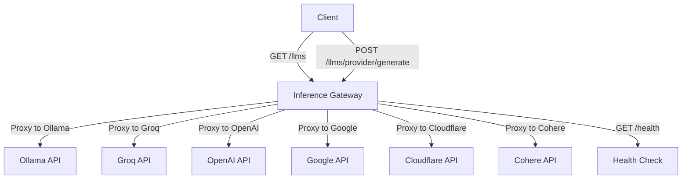

<h1 align="center">Inference Gateway</h1>

<p align="center">
  <!-- CI Status Badge -->
  <a href="https://github.com/edenreich/inference-gateway/actions/workflows/ci.yml?query=branch%3Amain">
    
  </a>
  <!-- Version Badge -->
  <a href="https://github.com/edenreich/inference-gateway/releases">
    
  </a>
  <!-- License Badge -->
  <a href="https://github.com/edenreich/inference-gateway/blob/main/LICENSE">
    
  </a>
</p>

The Inference Gateway is a proxy server designed to facilitate access to various language model APIs. It allows users to interact with different language models through a unified interface, simplifying the configuration and the process of sending requests and receiving responses from multiple LLMs, enabling an easy use of Mixture of Experts.

- [Overview](#overview)
- [Key Features](#key-features)
- [Supported API's](#supported-apis)
- [Configuration](#configuration)
- [Examples](#examples)
- [SDKs](#sdks)
- [License](#license)

## Overview



## Key Features

- 📜 **Open Source**: Available under the MIT License.
- 🚀 **Unified API Access**: Proxy requests to multiple language model APIs, including OpenAI, Ollama, Groq, Cohere etc.
- ⚙️ **Environment Configuration**: Easily configure API keys and URLs through environment variables.
- 🐳 **Docker Support**: Use Docker and Docker Compose for easy setup and deployment.
- ☸️ **Kubernetes Support**: Ready for deployment in Kubernetes environments.
- 📊 **OpenTelemetry Tracing**: Enable tracing for the server to monitor and analyze performance.
- 🛡️ **Production Ready**: Built with production in mind, with configurable timeouts and TLS support.
- 🌿 **Lightweight**: Includes only essential libraries and runtime, resulting in smaller size binary of ~10.8MB.
- 📉 **Minimal Resource Consumption**: Designed to consume minimal resources and have a lower footprint.
- 📚 **Documentation**: Well documented with examples and guides.
- 🧪 **Tested**: Extensively tested with unit tests and integration tests.
- 🛠️ **Maintained**: Actively maintained and developed.
- 📈 **Scalable**: Easily scalable and can be used in a distributed environment - with <a href="https://kubernetes.io/docs/tasks/run-application/horizontal-pod-autoscale/" target="_blank">HPA</a> in Kubernetes.
- 🔒 **Compliance** and Data Privacy: This project does not collect data or analytics, ensuring compliance and data privacy.
- 🏠 **Self-Hosted**: Can be self-hosted for complete control over the deployment environment.

## Supported API's

- [OpenAI](https://platform.openai.com/)
- [Ollama](https://ollama.com/)
- [Groq Cloud](https://console.groq.com/)
- [Google](https://aistudio.google.com/)
- [Cloudflare](https://www.cloudflare.com/)
- [Cohere](https://docs.cohere.com/docs/the-cohere-platform)

## Configuration

The Inference Gateway can be configured using environment variables. The following [environment variables](./Configurations.md) are supported.

## Examples

- Using [Docker Compose](examples/docker-compose/)
- Using [Kubernetes](examples/kubernetes/)
- Using standard [REST endpoints](examples/rest-endpoints/)

## SDKs

More SDKs could be generated using the OpenAPI specification. The following SDKs are currently available:

- [Go SDK](https://github.com/edenreich/inference-gateway-go-sdk)

## License

This project is licensed under the MIT License.

```

```
